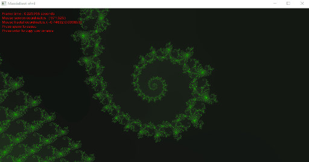

# mandelbrot_sfml
A multi-threaded mandelbrot renderer with sfml

# IMPORTANT
SFML is required to compile this project. You can get it here: **https://www.sfml-dev.org/download.php**

# USAGE
The program starts with zooming into a mandelbrot fractal. Pressing **space** will pause/resume. Pressing **Enter** will copy the fractal mouse coordinates to the console. This can be useful if you want to use this coordinates as a starting point and explore more!

Enjoy this little project as you see fit, and feel free to contact me!

Email: slimlimem@gmail.com
Linkedin: https://www.linkedin.com/in/slim-limem/
